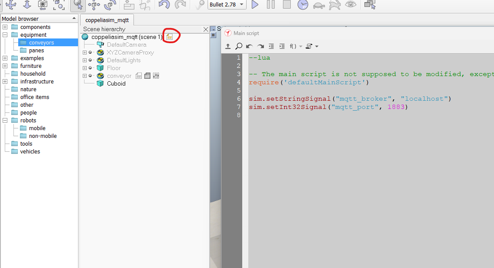
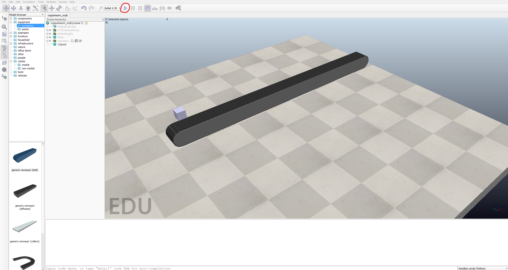

# CoppeliaSim with MQTT client

This repository presents a sample implementation of the Paho MQTT Client in Python using CoppeliaSim child scripts, with respect to callback functions.

Here is a video of the example running:

## Motivation

MQTT is a very important technology in IoT and is present in various industrial applications. As far as I have searched the web, there are no MQTT-ready scenarios in CoppeliaSim. It could be interfaced indirectly using the ZeroMQ or the socket API, but it would require additional libraries or another middleware in the communication. This code aims to aid people who are designing solutions using MQTT, and would like to use the Coppelia simulator for physics-driven scenarios, such as digital twins and industrial communications. Since the simulator is known for being both powerful and simple to use/install, this implementation tries to keep that minimalistic nature for the MQTT communication problem.

## Pre-requisites

- [CoppeliaSim Edu Version 4.6.0 (rev. 18)](https://www.coppeliarobotics.com/)
- [paho-mqtt 2.0](https://pypi.org/project/paho-mqtt/) (Which already implements MQTT 5 protocol)
- [Eclipse Mosquitto](https://mosquitto.org/download/)

## How to test

Double-click the script icon to open the main lua script. There, set the global variables (which Coppelia calls Signals) that will be shared across simulation objects. Here the important ones are the ip of the broker and the port, which are related to your Mosquitto (or respective broker) configuration.

Then start the simulation. If everything is working fine, the terminal at the bottom will print the messages "Connected to MQTT Broker!" and "Subscribed to conveyor/cmd_vel"

Now the simlation is publishing the conveyor state in topics conveyor/vel and conveyor/pos. In mosquitto, you can test using the command:

``
 $ mosquitto_sub -t conveyor/vel
``

Keep it running. The simulation is subscribing to the topic conveyor/cmd_vel to change the conveyor desired speed. To test it, run a simple publisher, such as:

``
 $ mosquitto_pub -t conveyor/vel -m 1.0
``

You will see that the conveyor starts to run and the velocity at conveyor/vel starts to raise (things present dynamics due to the physics engine).

